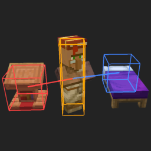
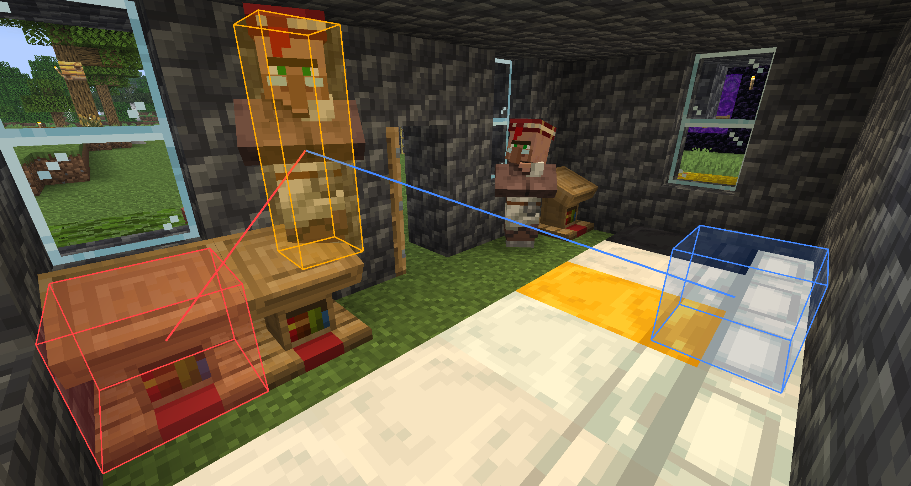

# Villager Helper

> Based on [VillagerHelper](https://github.com/Ivan-1F/VillagerHelper) by Ivan-1F, licensed under LGPL v3.

A client+server Fabric mod that lets you inspect villager POI (Point of Interest) assignments in-game using visual gizmo overlays.

## Features

- **Shift + right-click a villager** to select/deselect it — renders a highlight around it and draws lines to its bed (blue) and job site (red)
- **Shift + right-click a POI block** (bed, workstation, etc.) to look up which villager owns it, then toggle that villager's overlay
- Lines between the villager and its bed/job site remain visible even when the villager is out of render range (a line is drawn directly between bed and job site in that case)

**Note**: This mod must be installed on both client and server to work in multiplayer.

## Screenshot

